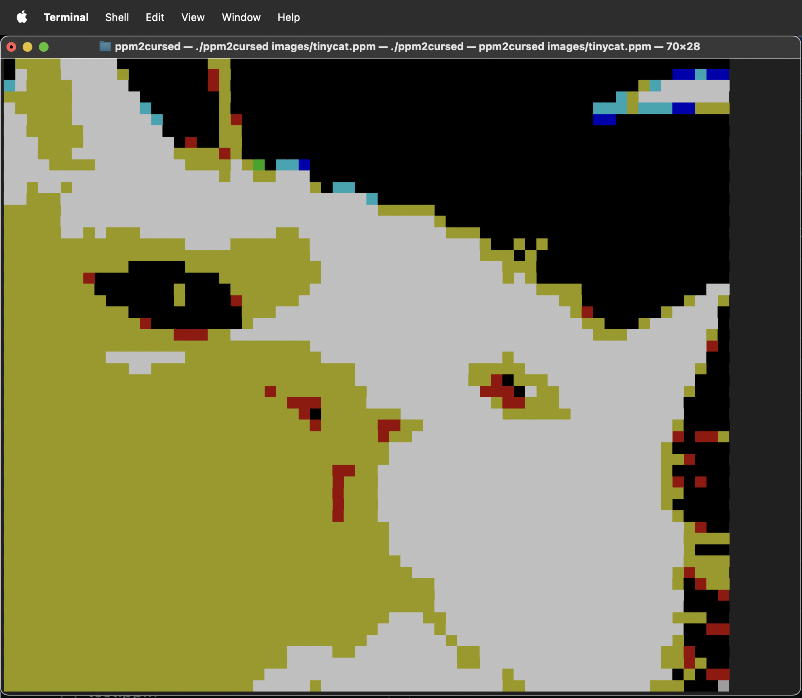

# img2uniscr 
Turns your terminal into a (terrible) screen, making use of the "▀" unicode glyph, each row of your terminal becomes two rows of 3-bit RGB pixels. 


*here you can see the *beautiful* 3 bit color depth.*

# Usage 
This project is structured in such a way that UniScreen.h will be able to be implemented as a library for creating displays. img2uniscr is designed to run on top of that, parsing, compressing, and displaying the images through UniScreen. 
TODO: Allow building of UniScreen by itself? So it can just be used as a display thing. Not super high priority since its mostly usesless.

- Regardless, I want to include a brief description of how to use public interface functions provided by UniScreen. 

# Build Dependencies
*TODO: add a cmake to install dependencies automatically.*
### Ncurses
Necessary to any build branches. Avaliable on homebrew: 
``` bash
    brew install ncurses
```

### ffmpeg 
Necessary to build all branches except for `standalone-uniscr`, and `ppm2uniscr`.

# Constraints
At the moment, it is assumed that your terminal is using the default values for ANSI colors set by modern macOS terminals. Exact values dont matter much, as the colors are extremely rough representations anyway, due to our limited color palette. As long as your terminal colors roughly match (i.e your yellow is actually yellow), it should be fine. 

# Libraries Used
### ncurses.h
Provides a mode for displaying chars, not super necessary for images, but I think it will help with videos.
Note that ncurses does not support wide characters unless you include the following macro ABOVE the ncurses.h include.
``` c
    #define _XOPEN_SOURCE_EXTENDED // necessary for wide chars
    #include <ncurses.h>
```
# External Tools Used

## Makefile
the Makefile was generated by `chatgpt-4o`. I hate writing Makefiles. Forgive me, until I learn cmake.
Until this is adapted to cmake, which will be after or near project completion, i'm not going to add any support for easy builiding on other platforms. The libraries 

## bear
Tool to auto generate `compile_commands.json` for LSP to understand the include paths and whatnot. Otherwise it freaks out with this sort of directory. I use with nvim, and it works. 

# Directory Breakdown
TODO: Upon completion, add a rough directory breakdown using `tree`.

# Q/A
## Why c11? 
Usually just default to c99, figured i'd check out c11. I know it added or improved the _Generic macro for function overloading, I hope to check that out at some point. I also believe it has multithreading improvements, although I cant really imagine using mutlithreading for this project. 

