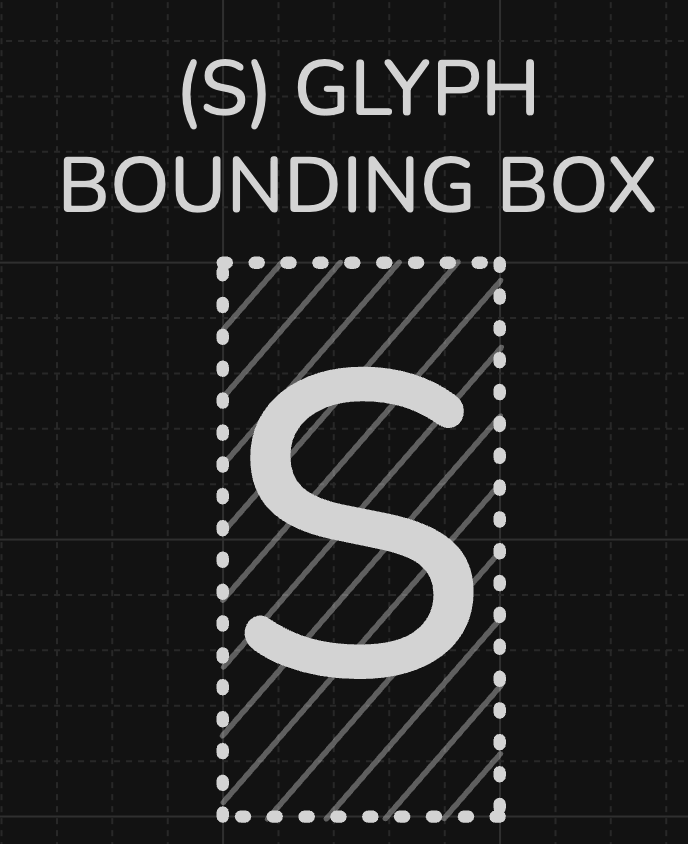
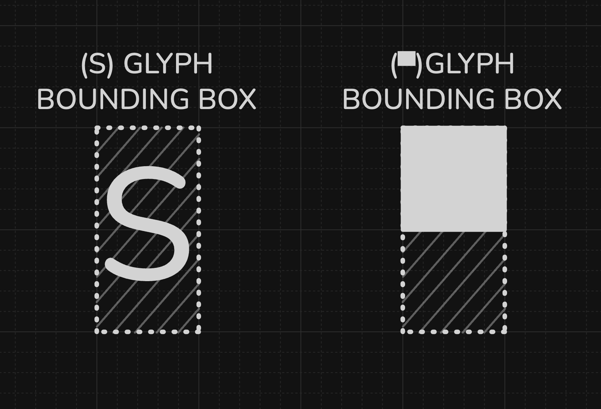
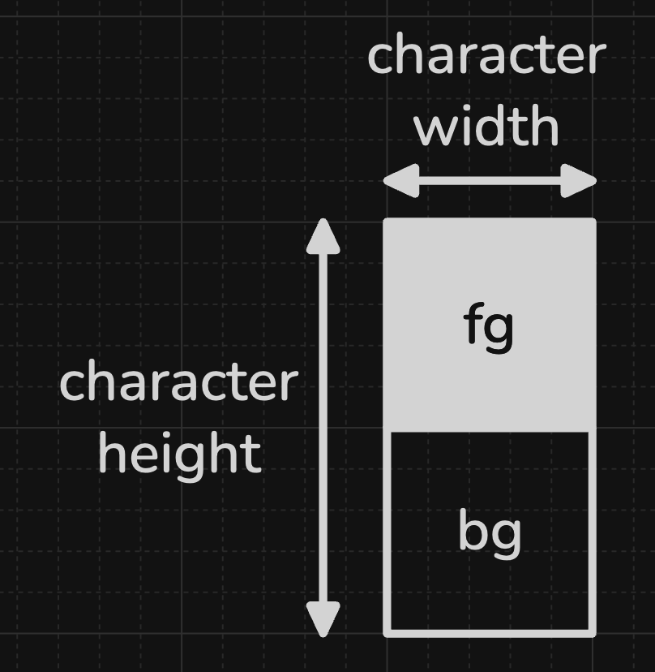
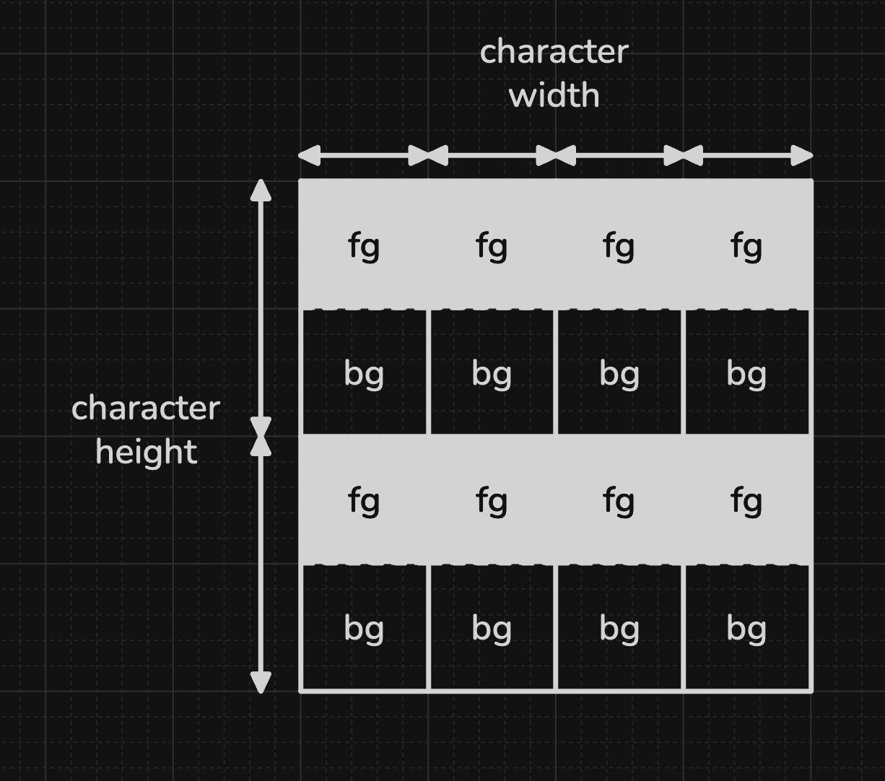
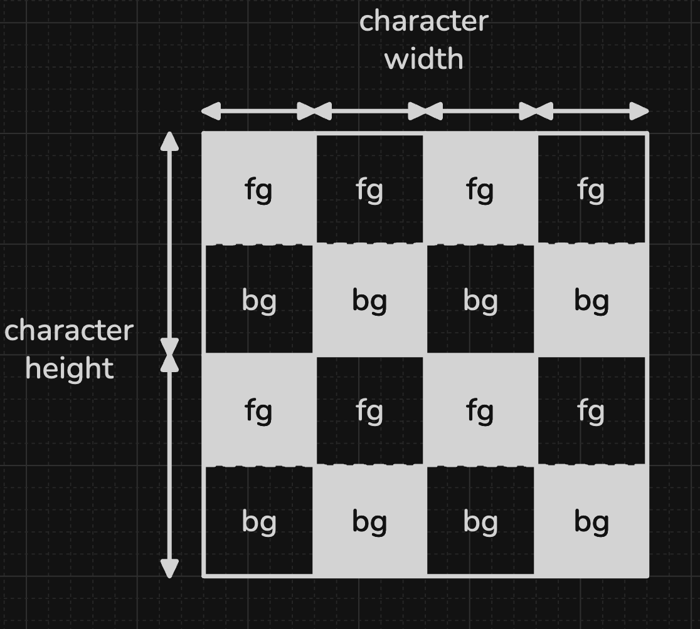
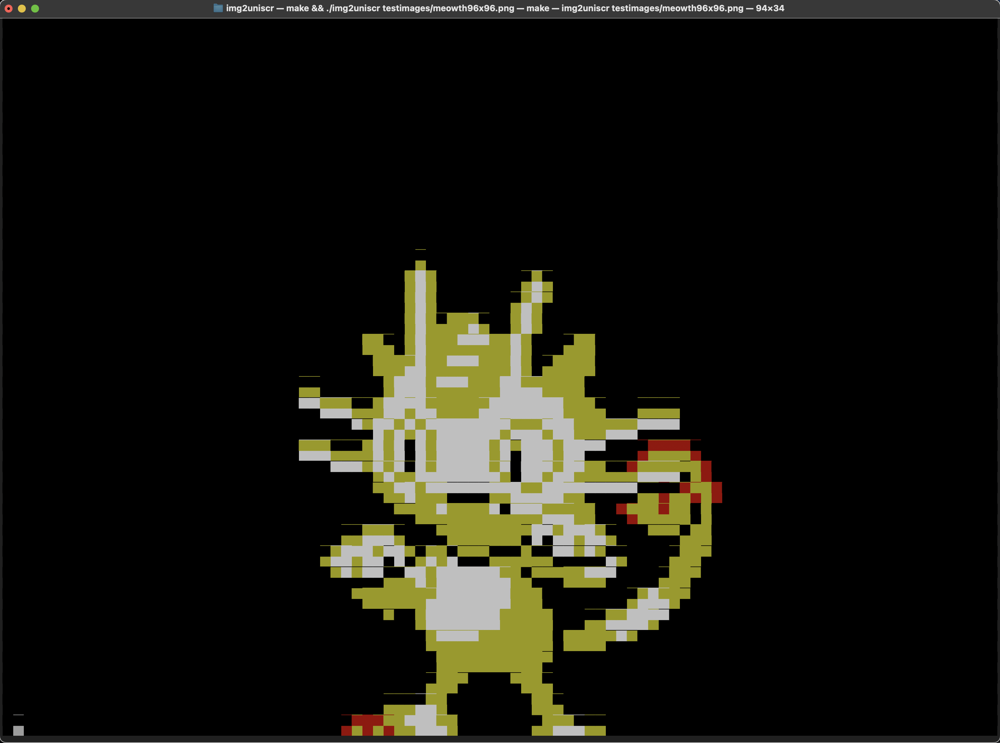

# img2uniscr 
Turns your terminal into a text based screen: making use of the "▀" unicode glyph, each row of your terminal becomes two rows of 3-bit RGB pixels. 


*here you can see the *beautiful* 3 bit color depth.*

# How does this work? 
First, we must understand that any 'glyph' in a font has a bounding box, which determines the area within which it will be drawn.
Monospace fonts, like those used in terminals, have the unique property of containing bounding boxes of the exact same width for all characters.



Whilst browsing some unicode characters, I found a rather unique one: the Upper Half Block, aka '▀' (U+2580).

An interesting property of this character is that in most typefaces, its a square, sitting neatly in the upper half of the glyphs bounding box.
This means that the bottom half of the bounding box also forms a square, if the font is monospaced.



---

Now, we need to which use an interface supported by 90% of modern terminals: 

## ANSI Escape Sequences
```bash
echo -e "\033[38;05;34;1mGREEN_TEXT"
# try this in your terminal.

```
These allow for setting certain properties of text to be rendered.
These properties include:
- color of the foreground (the actual 'stroke' of the glyph)
- color of the background (the bounding box outside of the glyph)
- Bold/bright/italic/faint toggles

The exact contents of the escape sequences aren't really relevant, as ncurses abstracts that away. The top answer [here](https://stackoverflow.com/questions/4842424/list-of-ansi-color-escape-sequences) has a good explanation if interested.

---
## Putting It Together
Now, for the moment of truth: we can encode a single character of '▀' with two "pixels":
- the "upper pixel" could be controlled by setting the foreground (fg) color
- the "lower pixel" could be controlled by setting the background (bg) color
Example:



Building this out, we can create images out of ANSI escape codes an a single unicode glyph, '▀'.



By changing some fg and bg colors:



This gives us square pixels, 2 per row, and 1 per column of text in the terminal.

# External Build Dependencies
*TODO: add a cmake to install dependencies automatically.*
### Ncurses
Necessary to build any branches. Avaliable on homebrew: 
``` bash
    brew install ncurses
```


# Usage 
Pass in an image to the program:
```bash
   ./img2uniscr [path/to/image]
```
And it should open up in glorious 3 bit color!



> [!NOTE] 
> *if you see repeated strings of �, this is probably your terminal trying to optimise drawing code. I've only observed this in iterm2 so far, so try it out in terminal if youre on mac.*


# Constraints
At the moment, it is assumed that your terminal is using the default values for ANSI colors set by modern macOS terminals. Exact values dont matter much, as the colors get compressed to hell anyway. As long as your terminal colors roughly match (i.e your yellow is actually yellow), it should be fine. 

Any images with width or height >96 currently arent processed properly, as my resizing implementation is broken. Will fix soon.


# Libraries Used
### ncurses.h
Provides a "terminal mode" for displaying chars. Its not really necessary for still images, but as this project expands to video I think it will prove useful.
``` c
    #define _XOPEN_SOURCE_EXTENDED // necessary for wide chars
    #include <ncurses.h>
```

### stb_image.h and stb_image_resize2.h
Single header libraries, very easy to include. Provides extremely simple interface for opening and reading image data.


# External Tools Used

## Makefile
the Makefile was generated by `chatgpt-4o`. I hate writing Makefiles. Forgive me, until I learn cmake.

## bear
Tool to auto generate `compile_commands.json` for LSP to understand the project structure. Works with nvim.


# Directory Breakdown
TODO: Upon completion, add a rough directory breakdown using `tree`.

# Q/A
## Why c11? 
Usually just default to c99, figured i'd check out c11. I know it added or improved the _Generic macro for function overloading, I hope to check that out at some point. I also believe it has multithreading improvements, although I cant really imagine using mutlithreading for this project. 

